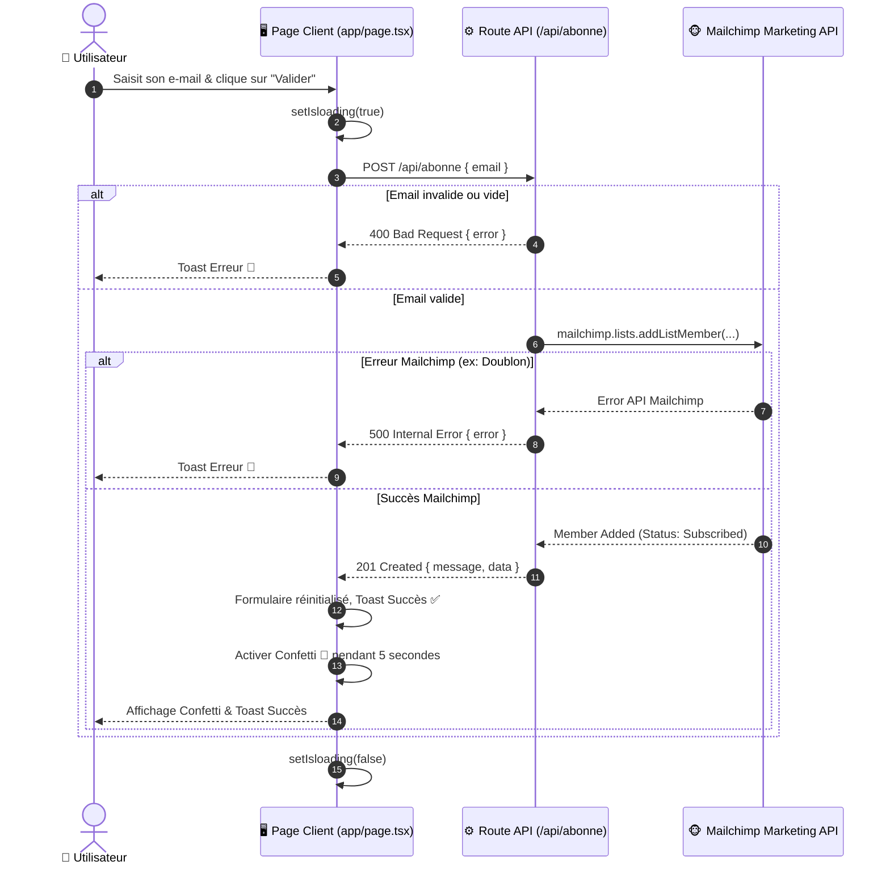

# 👨‍👩‍👧‍👦 Family-App — Documentation Technique & Guide d'Architecture Ultra-Premium

> **Version:** 0.1.0  
> **Framework:** Next.js 15.5.4 (App Router, Turbopack)  
> **Langage:** TypeScript 5.x & React 19.1.0  
> **Styling:** Tailwind CSS v4 & CSS3 Animations  
> **Service Tiers:** Mailchimp Marketing API (`@mailchimp/mailchimp_marketing`)  

---

## 📋 Table des Matières

1. [📌 Aperçu du Projet & Vision](#-aperçu-du-projet--vision)
2. [🏗 Architecture Globale & Stack Technique](#-architecture-globale--stack-technique)
3. [📂 Arborescence Exhaustive du Projet](#-arborescence-exhaustive-du-projet)
4. [📑 Analyse Détaillée des Pages & Composants](#-analyse-détaillée-des-pages--composants)
   - [Root Layout (`app/layout.tsx`)](#1-root-layout-applayouttsx)
   - [Page d'Accueil (`app/page.tsx`)](#2-page-daccueil-apppagetsx)
   - [Styles Globaux & Animations (`app/globals.css`)](#3-styles-globaux--animations-appglobalscss)
5. [🔌 Route API Backend & Intégration Mailchimp](#-route-api-backend--intégration-mailchimp)
   - [POST `/api/abonne`](#post-apiabonne)
6. [🔐 Configuration des Variables d'Environnement](#-configuration-des-variables-denvironnement)
7. [🚀 Guide d'Installation & Déploiement](#-guide-dinstallation--déploiement)
8. [📊 Flux de Données & Diagramme de Séquence](#-flux-de-données--diagramme-de-séquence)
9. [🎨 Effets Visuels & Système d'Animation UX](#-effets-visuels--système-danimation-ux)
10. [🛠 Guide de Maintenance & Évolutivité](#-guide-de-maintenance--évolutivité)
11. [❓ Dépannage & FAQ](#-dépannage--faq)

---

## 📌 Aperçu du Projet & Vision

**Family-App** est une application web moderne de captation d'audience et de newsletter communautaire dédiée aux rassemblements et engagements familiaux/spirituels ("Rendez-vous sacré avec la famille et le Très-Haut").

L'application offre une interface utilisateur élégante, immersive et hautement dynamique conçue pour offrir une expérience utilisateur (UX) fluide, interactive et mémorable :
- **Animations de particules dynamiques** en arrière-plan via `tsparticles`.
- **Cartes en verre dépoli (Glassmorphism)** avec retour visuel immédiat.
- **Célébration visuelle par confettis** (`react-confetti`) lors d'une inscription réussie.
- **Toasts de notification élégants** (`react-toastify`) pour informer immédiatement l'utilisateur.
- **Intégration directe avec Mailchimp Marketing API** pour l'enregistrement automatique des abonnés dans une liste d'audience ciblée.

---

## 🏗 Architecture Globale & Stack Technique

L'application repose sur l'architecture **Next.js App Router (v15)** exploitant la séparation stricte entre les composants clients et les routes d'API serveur sécurisées.

```
                  +---------------------------------------------------+
                  |                 Navigateur Client                 |
                  |  (React 19, Tailwind CSS v4, tsParticles, Toast)  |
                  +-------------------------+-------------------------+
                                            |
                                            | HTTP POST /api/abonne
                                            v
                  +---------------------------------------------------+
                  |          Next.js App Router (Serveur Node)        |
                  |              app/api/abonne/route.ts              |
                  +-------------------------+-------------------------+
                                            |
                                            | HTTPS / Mailchimp SDK
                                            v
                  +---------------------------------------------------+
                  |               Mailchimp Marketing API             |
                  |                (Lists / Audience)                 |
                  +---------------------------------------------------+
```

### Matrice des Technologies

| Domaine | Technologie | Version | Rôle & Utilité |
| :--- | :--- | :--- | :--- |
| **Core Framework** | Next.js | `15.5.4` | Framework React SSR/SSG avec App Router et compilation Turbopack. |
| **UI Library** | React | `19.1.0` | Bibliothèque front-end réactive. |
| **Langage** | TypeScript | `^5.0.0` | Typerigide garantissant la robustesse du code et l'autocomplétion. |
| **Styles & Layout** | Tailwind CSS | `^4.0.0` | Framework CSS utilitaire de nouvelle génération via `@tailwindcss/postcss`. |
| **Fonts** | `@next/font/google` | `Geist` & `Geist Mono` | Optimisation et chargement fluide des polices Vercel Geist sans Layout Shift. |
| **Particules UX** | `react-tsparticles` / `tsparticles` | `2.12.2` / `3.9.1` | Moteur de rendu de particules canvas d'arrière-plan. |
| **Confettis** | `react-confetti` | `^6.4.0` | Animation visuelle festive post-formulaire. |
| **Notifications** | `react-toastify` | `^11.0.5` | Feedback utilisateur (succès / erreurs). |
| **Loaders UI** | `react-spinners` | `^0.17.0` | Indicateurs de chargement (`ClipLoader`). |
| **Icons** | `lucide-react` | `^0.544.0` | Jeux d'icônes vectorielles modernes (`X`). |
| **Hooks Utilitaires** | `react-use` | `^17.6.0` | Custom hooks (`useWindowSize` pour le dimensionnement canvas responsive). |
| **Integration Tiers**| `@mailchimp/mailchimp_marketing` | `^3.0.80` | SDK Officiel Mailchimp pour la gestion des listes de diffusion. |

---

## 📂 Arborescence Exhaustive du Projet

```
Family-app/
├── 📁 app/                          # Dossier racine Next.js App Router
│   ├── 📁 api/                      # Routes d'API serveur (Backend Edge/Node)
│   │   └── 📁 abonne/               # Endpoint d'abonnement newsletter
│   │       └── 📄 route.ts          # Gestionnaire HTTP POST (Mailchimp SDK)
│   ├── 📄 favicon.ico               # Icône du site dans l'onglet navigateur (25.9 KB)
│   ├── 📄 globals.css               # Directives Tailwind CSS v4 & Keyframes personnalisées
│   ├── 📄 layout.tsx                # Structure racine de l'application & polices
│   └── 📄 page.tsx                  # Composant Client ("use client") - Page d'accueil & Formulaire
├── 📁 public/                       # Ressources statiques (Images & Logos)
│   ├── 🖼️ 1.jpeg                    # Visuel statique (89 KB)
│   ├── 🖼️ 2.jpeg                    # Visuel statique (160 KB)
│   ├── 🖼️ 3.jpeg                    # Visuel statique (93.5 KB)
│   ├── 🖼️ 4.jpeg                    # Visuel statique (74.3 KB)
│   ├── 🖼️ 5.jpeg                    # Visuel statique (85 KB)
│   ├── 🖼️ logo1.png                 # Logo principal haute résolution (1.3 MB)
│   ├── 🖼️ logo2.png                 # Logo secondaire haute résolution (1.1 MB)
│   ├── 🖼️ logo3.png                 # Variante logo compacte (72.6 KB)
│   └── 🖼️ positive.jpeg             # Illustration d'ambiance (223.8 KB)
├── 📄 .gitignore                    # Fichiers et dossiers exclus de Git
├── 📄 eslint.config.mjs             # Configuration ESLint 9 avec règles Next.js & TypeScript
├── 📄 next.config.ts                # Configuration globale du framework Next.js
├── 📄 package-lock.json             # Arbre de dépendances verrouillé
├── 📄 package.json                  # Script de build et manifeste des dépendances
├── 📄 postcss.config.mjs            # Plugin PostCSS avec support Tailwind CSS v4
├── 📄 README.md                     # Documentation officielle du projet
└── 📄 tsconfig.json                 # Configuration du compilateur TypeScript
```

---

## 📑 Analyse Détaillée des Pages & Composants

### 1. Root Layout (`app/layout.tsx`)

Le fichier `app/layout.tsx` constitue l'enveloppe HTML fondamentale de toute l'application.

- **Importation des Polices :** Importe `Geist` et `Geist_Mono` depuis `next/font/google` sous forme de variables CSS (`--font-geist-sans` et `--font-geist-mono`).
- **Métadonnées :** Définit les balises `<title>` et `<meta description>` par défaut.
- **Rendu HTML :** Applique la langue anglaise (`lang="en"`) et injecte la classe `antialiased` sur le `<body>` pour un rendu typographique lisse sur tous les écrans.

```tsx
// Fichier : app/layout.tsx
import type { Metadata } from "next";
import { Geist, Geist_Mono } from "next/font/google";
import "./globals.css";

const geistSans = Geist({
  variable: "--font-geist-sans",
  subsets: ["latin"],
});

const geistMono = Geist_Mono({
  variable: "--font-geist-mono",
  subsets: ["latin"],
});

export const metadata: Metadata = {
  title: "Family App",
  description: "Rejoignez notre communauté familiale et spirituelle",
};

export default function RootLayout({
  children,
}: Readonly<{ children: React.ReactNode }>) {
  return (
    <html lang="fr">
      <body className={`${geistSans.variable} ${geistMono.variable} antialiased`}>
        {children}
      </body>
    </html>
  );
}
```

---

### 2. Page d'Accueil (`app/page.tsx`)

Le composant `Home` dans `app/page.tsx` est un **Client Component** (`"use client"`) qui intègre toute la logique interactive front-end.

#### 🧠 États du Composant (State Management)
- `email` (`string`) : Stocke l'adresse e-mail saisie par l'utilisateur.
- `isLoading` (`boolean`) : Gère l'état de chargement lors de la soumission de la requête d'API.
- `showConfetti` (`boolean`) : Active ou désactive le lancer de confettis.
- `{ width, height }` (`react-use`) : Écoute les dimensions de la fenêtre pour ajuster le composant Confetti et Particules.

#### ⚡ Fonctionnalités & Logique métier (`handleSubmit`)
1. Empêche le rechargement de la page (`e.preventDefault()`).
2. Passe `isLoading` à `true`.
3. Effectue un appel `fetch` `POST` vers `/api/abonne` avec le body `{ email }`.
4. **En cas de succès (`response.ok`) :**
   - Affiche un Toast de succès (`toast.success("Inscription réussie ✅")`).
   - Réinitialise le champ `email`.
   - Active `showConfetti(true)` pendant 5000 millisecondes (5s).
5. **En cas d'erreur HTTP :**
   - Lit le message d'erreur retourné par l'API (`data.error`) et l'affiche via `toast.error()`.
6. Repasse `isLoading` à `false` dans le bloc final.

#### 🌌 Composant Particules & Visuel
- Utilise `<Particles />` de `react-tsparticles` initialisé via `loadFull(main)`.
- Configure 50 particules aux teintes dorées et pastel (`#fcd34d`, `#f87171`, `#a78bfa`) se déplaçant doucement vers le haut (`direction: "top"`).
- Carte centrale en verre dépoli avec `backdrop-blur-md bg-white/90` et animation au survol (`hover:scale-105`).

---

### 3. Styles Globaux & Animations (`app/globals.css`)

Le fichier `globals.css` configure le moteur Tailwind CSS v4 (`@import "tailwindcss";`) ainsi que les animations personnalisées utilisées par la carte et le bouton.

```css
@import "tailwindcss";

/* Animation de flottaison douce pour le titre principal */
@keyframes float {
  0%, 100% { transform: translateY(0px); }
  50% { transform: translateY(-10px); }
}

.float-animation {
  animation: float 5s ease-in-out infinite;
}

/* Animation de pulsation du bouton d'action */
@keyframes pulse-success {
  0%, 100% { transform: scale(1); }
  50% { transform: scale(1.05); }
}

.animate-pulse-on-success {
  animation: pulse-success 5s ease-in-out infinite;
}
```

---

## 🔌 Route API Backend & Intégration Mailchimp

L'API d'abonnement est hébergée sur l'endpoint `/api/abonne/route.ts`. Elle s'exécute côté serveur (Node.js/Edge Runtime) et communique de manière sécurisée avec Mailchimp sans exposer les clés API au client.

### POST `/api/abonne`

#### Configuration Mailchimp SDK
```typescript
import mailchimp from "@mailchimp/mailchimp_marketing";

mailchimp.setConfig({
  apiKey: process.env.MAILCHIMP_API_KEY!,
  server: process.env.MAILCHIMP_API_SERVER!, // Exemple: us21
});
```

#### Requête HTTP
- **Méthode :** `POST`
- **Headers :** `Content-Type: application/json`
- **Body JSON :**
  ```json
  {
    "email": "utilisateur@exemple.com"
  }
  ```

#### Réponses HTTP & Codes Statuts

| Statut Code | Condition | Exemple de Réponse JSON |
| :--- | :--- | :--- |
| **`201 Created`** | Inscription Mailchimp réussie | `{"message": "Email inscrit avec succès ✅", "data": {...}}` |
| **`400 Bad Request`** | Champ `email` manquant ou vide | `{"error": "Veuillez entrer une adresse e-mail valide !"}` |
| **`500 Internal Error`** | Email déjà existant ou clé API invalide | `{"error": "Cette adresse e-mail n'est pas valide ou est déjà utilisée 🚫"}` |

---

## 🔐 Configuration des Variables d'Environnement

Pour fonctionner correctement avec le service Mailchimp, créez un fichier `.env.local` à la racine de votre projet :

```env
# Clé API Mailchimp (fournie dans l'espace développeur Mailchimp)
MAILCHIMP_API_KEY=votre_api_key_mailchimp

# Prefix Serveur Mailchimp (ex: us21, us6, etc. - indiqué à la fin de votre API Key)
MAILCHIMP_API_SERVER=votre_serveur_prefix

# ID de la liste d'audience (Audience ID / List ID Mailchimp)
MAILCHIMP_AUDIENCE_ID=votre_audience_id
```

> ⚠️ **Sécurité :** Ne commitez JAMAIS le fichier `.env.local` dans votre dépôt Git. Assurez-vous qu'il est bien listé dans le fichier `.gitignore`.

---

## 🚀 Guide d'Installation & Déploiement

### Prérequis
- **Node.js** `>= 18.17.0` (Recommandé: LTS Node v20+)
- **npm**, **yarn**, **pnpm** ou **bun**

### 1. Cloner le Projet & Installer les Dépendances
```bash
git clone https://github.com/J-kalvin007/Family-app.git
cd Family-app
npm install
```

### 2. Démarrer le Serveur de Développement (avec Turbopack)
```bash
npm run dev
```
Ouvrez [http://localhost:3000](http://localhost:3000) dans votre navigateur.

### 3. Compiler pour la Production (Build)
```bash
npm run build
```

### 4. Lancer l'Application Compilée
```bash
npm run start
```

### 5. Vérification du Linter
```bash
npm run lint
```

---

## 📊 Flux de Données & Diagramme de Séquence

Le diagramme de séquence ci-dessous illustre le parcours d'une souscription du formulaire jusqu'au serveur Mailchimp :



---

## 🎨 Effets Visuels & Système d'Animation UX

| Composant Visuel | Outil / Bibliothèque | Rôle dans l'application |
| :--- | :--- | :--- |
| **Fond animé à particules** | `tsparticles` + `react-tsparticles` | Particules lumineuses flottantes aux couleurs thématiques (`#fcd34d`, `#f87171`, `#a78bfa`). |
| **Effet Confetti** | `react-confetti` | Déclenchement de 250 confettis légers (`gravity: 0.2`) lors de la confirmation d'abonnement. |
| **Glassmorphism** | Tailwind CSS (`backdrop-blur-md bg-white/90`) | Carte centrale transparente et surélevée offrant une profondeur visuelle remarquable. |
| **Clear Input (Effacer)** | `lucide-react` (`X`) | Permet de vider instantanément le champ de saisie en un seul clic. |
| **Toast Notifications** | `react-toastify` | Messages pop-up non bloquants positionnés en haut au centre (`top-center`). |

---

## 🛠 Guide de Maintenance & Évolutivité

Pour faire évoluer **Family-App** et ajouter de nouvelles fonctionnalités (par exemple : nouvelles pages, gestion multi-langues, authentification) :

1. **Ajouter de nouveaux champs au formulaire (ex: Nom, Prénom, Téléphone) :**
   - Modifier les états React dans `app/page.tsx`.
   - Mettre à jour le body du `fetch` dans `handleSubmit`.
   - Modifier l'appel `mailchimp.lists.addListMember` dans `app/api/abonne/route.ts` en passant les `merge_fields` (ex: `FNAME`, `LNAME`).

2. **Personnaliser le thème visuel :**
   - Modifier les keyframes dans `app/globals.css`.
   - Ajuster la palette de couleurs Tailwind (`amber`, `slate`, `blue`, `indigo`).

3. **Passer à un autre service de mailing (SendGrid, Resend, Brevo) :**
   - Il suffit de modifier uniquement le fichier `app/api/abonne/route.ts` sans impacter le code du composant front-end `app/page.tsx`.

---

## ❓ Dépannage & FAQ

#### 🔴 L'inscription échoue avec une erreur 500 dans la console
> **Cause possible :** Les variables d'environnement `MAILCHIMP_API_KEY`, `MAILCHIMP_API_SERVER` ou `MAILCHIMP_AUDIENCE_ID` ne sont pas définies ou sont incorrectes.  
> **Solution :** Vérifiez votre fichier `.env.local` et redémarrez le serveur de développement (`npm run dev`).

#### 🔴 L'email saisi signale "déjà utilisé"
> **Cause possible :** Mailchimp refuse la réinscription directe d'une adresse déjà présente dans l'audience en statut `subscribed`.  
> **Solution :** Testez avec une nouvelle adresse e-mail ou utilisez le mode `pending` (double opt-in) dans `route.ts`.

#### 🔴 Problème de rendu des particules ou des confettis sur mobile
> **Solution :** Le composant `useWindowSize` de `react-use` récalcule dynamiquement la taille du viewport. Assurez-vous que l'élément parent possède `overflow-hidden` sur le container principal pour éviter tout défilement horizontal parasite.

